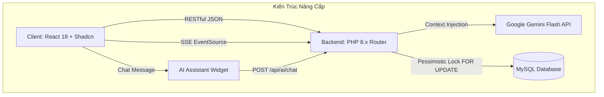

# 🎬 KẾ HOẠCH NÂNG CẤP HỆ THỐNG GALAXY CINEMA & TÍCH HỢP CHATBOX AI
> **Tài liệu phân công nhiệm vụ, lộ trình kỹ thuật và tiêu chí nghiệm thu (Team 5 người)**  
> **Thời gian dự kiến:** 3 Tuần (15 ngày làm việc)  
> **Phiên bản:** 2.1 - Production Ready  

---

## 📌 MỤC LỤC
1. [Tổng Quan Hiện Trạng & Mục Tiêu Nâng Cấp](#1-tổng-quan-hiện-trạng--mục-tiêu-nâng-cấp)
2. [Bảng Ma Trận Phân Chia Trách Nhiệm (5 Thành Viên)](#2-bảng-ma-trận-phân-chia-trách-nhiệm-5-thành-viên)
3. [Chi Tiết Nhiệm Vụ Từng Thành Viên](#3-chi-tiết-nhiệm-vụ-từng-thành-viên)
   - [🔴 DEV 1: Team Leader – Backend Security & Concurrency](#dev-1-team-leader--backend-security--concurrency)
   - [🔵 DEV 2: Backend Business Logic & Thống Kê Admin](#dev-2-backend-business-logic--thống-kê-admin)
   - [🟣 DEV 3: Kỹ Sư AI Fullstack – Chatbox Cinema Assistant](#dev-3-kỹ-sư-ai-fullstack--chatbox-cinema-assistant)
   - [🟢 DEV 4: Frontend Core – Luồng Đặt Vé Thật & Realtime Sync](#dev-4-frontend-core--luồng-đặt-vé-thật--realtime-sync)
   - [🟡 DEV 5: Frontend Integration, Xóa Mock Data & Staff Scanner](#dev-5-frontend-integration-xóa-mock-data--staff-scanner)
4. [Lộ Trình Triển Khai 3 Tuần (Sprint Roadmap)](#4-lộ-trình-triển-khai-3-tuần-sprint-roadmap)
5. [Quy Chuẩn Git, Phân Nhánh & Tránh Xung Đột](#5-quy-chuẩn-git-phân-nhánh--tránh-xung-đột)

---

## 1. TỔNG QUAN HIỆN TRẠNG & MỤC TIÊU NÂNG CẤP

### 1.1. Các hạn chế nghiêm trọng cần khắc phục ngay
1. **Lỗ hổng bảo mật OTP:** Mã OTP lưu dạng JSON trên ổ đĩa (`backend/uploads/verification_codes.json`), dễ bị đọc trộm qua URL công khai.
2. **Đứt gãy luồng thanh toán:** Trang `PaymentPage.tsx` đang giả lập bằng `setTimeout` và sinh mã vé ngẫu nhiên, **chưa hề gọi API lưu đơn vào cơ sở dữ liệu MySQL**.
3. **Lỗi tranh chấp ghế (Race Condition):** Hàm kiểm tra ghế trống chưa có cơ chế khóa hàng `FOR UPDATE`, dẫn tới nguy cơ 2 người đặt trùng 1 ghế.
4. **Khuyết 7 Controller/Model ở Backend:** `backend/index.php` khai báo nhiều route (`promotions`, `loyalty`, `vouchers`, `admin/stats`,...) nhưng chưa hề có file xử lý logic trong `controllers/`.
5. **Dữ liệu giả (Mock Data) tràn lan:** `BookingHistoryPage`, `PromotionsPage`, `ProfilePage`, `AdminDashboard` đang đọc mảng tĩnh từ `mockData.ts`.

### 1.2. Các tính năng đột phá cần bổ sung
- 🤖 **AI Cinema Assistant:** Chatbox thông minh (Google Gemini 1.5/2.0 Flash) hiểu tiếng Việt, tư vấn phim theo cảm xúc/độ tuổi, tự động đọc lịch chiếu từ MySQL và hiển thị thẻ phim có nút đặt vé ngay.
- ⚡ **Real-time Seat Hold (SSE):** Ghế tự đổi màu vàng (Holding) trên màn hình người khác ngay khi có người giữ chỗ, không cần F5.
- 🎟️ **E-Ticket PDF & QR Scanner:** Xuất file PDF vé xem phim sang trọng và nâng cấp trang soát vé bằng Camera máy tính/điện thoại cho nhân viên.



---

## 2. BẢNG MA TRẬN PHÂN CHIA TRÁCH NHIỆM (5 THÀNH VIÊN)

| Thành viên | Vai trò chính | Module phụ trách | Độ ưu tiên |
| :--- | :--- | :--- | :---: |
| **DEV 1** | Team Leader & Backend Core | Bảo mật Auth, OTP MySQL, Khóa ghế Concurrency, Dọn rác Router, SSE Stream | 🔴 P0 (Khẩn cấp) |
| **DEV 2** | Backend Logic & Admin API | Bổ sung 7 Controller & Model (Promotion, Voucher, Loyalty, Membership, Admin, Config, Notification) | 🔴 P0 (Khẩn cấp) |
| **DEV 3** | AI Fullstack Engineer | Toàn bộ tính năng Chatbox AI (Backend AIService + Gemini API + Frontend ChatBotWidget + Rich Cards) | 🟡 P1 (Đột phá) |
| **DEV 4** | Frontend Core & Booking | Nối API Đặt vé thật vào DB, Nhận diện ghế Real-time, Xuất vé PDF E-Ticket | 🔴 P0 (Khẩn cấp) |
| **DEV 5** | Frontend Integration & UI | Xóa 100% Mock Data, Quét vé QR bằng Camera cho Staff, Chuẩn hóa tên file & Bản đồ | 🟡 P1 (Hoàn thiện) |

---

## 3. CHI TIẾT NHIỆM VỤ TỪNG THÀNH VIÊN

---

### 🔴 DEV 1: Team Leader – Backend Security & Concurrency
* **Chuyên môn:** PHP, Database Architecture, Security.
* **Mục tiêu:** Vá triệt để lỗ hổng bảo mật, loại bỏ nợ kỹ thuật (technical debt), xử lý giao dịch dữ liệu toàn vẹn.

#### Danh mục công việc chi tiết:
1. **Khắc phục lỗ hổng OTP JSON:**
   - Xóa bỏ hoàn toàn việc ghi file `uploads/verification_codes.json`.
   - Tạo migration bảng `email_verifications` trong MySQL:
     ```sql
     CREATE TABLE email_verifications (
         id INT AUTO_INCREMENT PRIMARY KEY,
         email VARCHAR(255) NOT NULL,
         code VARCHAR(6) NOT NULL,
         expires_at DATETIME NOT NULL,
         created_at TIMESTAMP DEFAULT CURRENT_TIMESTAMP,
         INDEX idx_email_code (email, code)
     );
     ```
   - Cập nhật `backend/controllers/AuthController.php`: Phương thức `sendVerification` ghi mã OTP vào bảng trên (TTL = 5 phút); phương thức `verifyEmail` kiểm tra mã còn hạn và xóa mã ngay sau khi xác thực thành công.
2. **Xử lý Race Condition khi giữ ghế (Pessimistic Locking):**
   - Sửa hàm `getUnavailableSeats()` và `create()` trong `backend/models/Booking.php`.
   - Sử dụng `BEGIN TRANSACTION` và bổ sung **`FOR UPDATE`** vào câu truy vấn kiểm tra trạng thái vé:
     ```sql
     SELECT t.seat_id, t.status 
     FROM tickets t
     JOIN bookings b ON t.booking_id = b.id
     WHERE b.showtime_id = :showtime_id 
       AND t.seat_id IN (...)
       AND (t.status = 'SOLD' OR (t.status = 'HOLDING' AND t.hold_expires_at > NOW()))
     FOR UPDATE;
     ```
   - Nếu phát hiện ghế đã có người giữ, lập tức `ROLLBACK` và ném thông báo: *"Ghế vừa được người khác giữ chỗ, vui lòng chọn ghế khác!"*.
3. **Dọn dẹp mã nguồn & Tinh giản Router:**
   - **Xóa bỏ toàn bộ thư mục `backend/api/` cũ** (chấm dứt tình trạng chạy 2 router song song gây lỗi CORS).
   - Xóa bỏ dòng log đĩa `file_put_contents('debug_index_hit.txt')` trong `backend/index.php`.
   - Di chuyển/xóa bỏ 16 file script test ở root `backend/` (`login_direct.php`, `test_auth_apis.php`,...).
4. **Viết Endpoint Server-Sent Events (SSE) cho trạng thái ghế:**
   - Tạo endpoint `GET /api/showtimes/:id/seat-stream` trong `backend/controllers/ShowtimeController.php`.
   - Trả về Header `text/event-stream`, tự động gửi danh sách ID các ghế đang ở trạng thái `HOLDING` mỗi 3-5 giây.

* **Tiêu chí hoàn thành (DoD):**
  - [ ] Không còn file `verification_codes.json` trong `uploads/`.
  - [ ] Test đồng thời 2 request giữ cùng 1 ghế: Chỉ duy nhất 1 request thành công, request thứ hai nhận mã lỗi 409 Conflict.
  - [ ] Request toàn hệ thống đi qua `backend/index.php` trơn tru, không còn lỗi CORS `localhost:8080`.

---

### 🔵 DEV 2: Backend Business Logic & Thống Kê Admin
* **Chuyên môn:** PHP MVC, MySQL Query, API Design.
* **Mục tiêu:** Viết mới 7 Controller và Model đang khuyết để hoàn thành 100% đặc tả RESTful API.

#### Danh mục công việc chi tiết:
1. **Module Khuyến Mãi & Voucher:**
   - Tạo `backend/controllers/PromotionController.php` & `backend/models/Promotion.php`:
     - `GET /api/promotions`: Danh sách khuyến mãi đang hoạt động (`NOW() BETWEEN start_date AND end_date`).
     - `GET /api/promotions/:id`: Chi tiết điều kiện khuyến mãi.
     - `POST/PUT/DELETE /api/promotions` (Role: Admin/Manager).
   - Tạo `backend/controllers/VoucherController.php` & `backend/models/UserVoucher.php`:
     - `GET /api/vouchers/user/:userId`: Danh sách voucher cá nhân khả dụng.
     - `POST /api/vouchers/apply`: Kiểm tra điều kiện đơn hàng tối thiểu và tính số tiền giảm trừ.
2. **Module Điểm Thưởng (Loyalty) & Hạng Thành Viên (Membership):**
   - Tạo `backend/controllers/LoyaltyController.php` & `backend/models/LoyaltyHistory.php`:
     - `GET /api/loyalty/history/:userId`: Lịch sử cộng/trừ điểm.
     - `POST /api/loyalty/earn`: Tự động kích hoạt khi booking chuyển sang `Paid` (10.000đ = 1 điểm).
     - `POST /api/loyalty/redeem`: Đổi điểm lấy voucher khuyến mãi.
   - Tạo `backend/controllers/MembershipController.php` & `backend/models/Membership.php`:
     - `GET /api/memberships`: Lấy danh sách 4 hạng (Bronze, Silver, Gold, Platinum) kèm mức chiết khấu.
3. **Module Thông Báo (Notifications) & Cấu Hình (Configs):**
   - Tạo `backend/controllers/NotificationController.php` & `backend/models/Notification.php`:
     - `GET /api/notifications/user/:userId`: Lấy thông báo cá nhân (đặt vé thành công, voucher mới).
     - `PUT /api/notifications/:id/read`: Đánh dấu thông báo đã đọc.
   - Tạo `backend/controllers/ConfigController.php` & `backend/models/SystemConfig.php`:
     - `GET /api/config`: Trả về quy định tỷ lệ phim Việt tối thiểu (15%), thời gian giữ ghế (10 phút).
4. **Module Thống Kê Báo Cáo Admin:**
   - Tạo `backend/controllers/AdminController.php`:
     - `GET /api/admin/stats`: Doanh thu hôm nay/tháng, tổng số vé bán, số thành viên mới từ DB.
     - `GET /api/admin/revenue`: Báo cáo doanh thu theo mốc ngày cho biểu đồ Recharts.
     - `GET /api/admin/seat-heatmap`: Thống kê tần suất ghế được đặt nhiều nhất theo từng phòng chiếu.

* **Tiêu chí hoàn thành (DoD):**
  - [ ] 7 file Controller và Model được tạo đúng chuẩn, tuân thủ `BaseController` và `Database::getInstance()`.
  - [ ] Toàn bộ 15 endpoint kiểm thử thành công bằng Postman, trả về mã HTTP 200/201 chuẩn RESTful.

---

### 🟣 DEV 3: Kỹ Sư AI Fullstack – Chatbox Cinema Assistant
* **Chuyên môn:** LLM API Integration, Prompt Engineering, React UI/UX.
* **Mục tiêu:** Xây dựng trợ lý ảo Galaxy Cinema độc quyền, có khả năng tư vấn phim và tương tác đặt vé theo ngôn ngữ tự nhiên.

#### Danh mục công việc chi tiết:
1. **Thiết kế Backend AI Service & Tích Hợp Gemini Flash:**
   - Thêm biến môi trường vào `backend/.env`: `GEMINI_API_KEY=AIzaSy...` (Lấy key miễn phí từ Google AI Studio).
   - Tạo `backend/service/AIService.php`:
     - Sử dụng model `gemini-1.5-flash` (hoặc `gemini-2.0-flash`) với tốc độ phản hồi cực nhanh (< 1 giây).
     - **Dynamic Context Injection (Kỹ thuật RAG nhẹ):** Trước khi gọi Gemini, truy vấn MySQL lấy danh sách phim có `status = 'Now Showing'` (gồm: tên phim, thể loại, độ tuổi `P/T13/T16/T18`, thời lượng) và tên các cụm rạp hiện hành.
     - Xây dựng **System Prompt** đóng vai chuyên viên CSKH của Galaxy Cinema: Lịch sự, vui tươi, am hiểu điện ảnh, luôn gợi ý phim đúng danh sách đang chiếu, nhắc nhở quy định kiểm duyệt độ tuổi và giới nghiêm sau 22h.
2. **Xây dựng Controller & Route AI:**
   - Tạo `backend/controllers/AIController.php` với phương thức `chat()`.
   - Đăng ký route trong `backend/index.php`:
     ```php
     $router->post('/api/ai/chat', 'AIController@chat');
     ```
   - Định dạng dữ liệu trả về:
     ```json
     {
       "success": true,
       "data": {
         "reply": "Chào bạn! Nếu bạn thích hành động kịch tính...",
         "recommended_movies": [
           { "id": 1, "title": "Dune 2", "poster_url": "...", "age_rating": "T16" }
         ]
       }
     }
     ```
3. **Xây dựng Giao Diện Chatbox Widget ở Frontend:**
   - Tạo file `source-code/galaxy-cinema-hub-main/src/components/ai/ChatBotWidget.tsx`:
     - Nút tròn nổi ở góc dưới bên phải (`bottom-6 right-6 z-50`), biểu tượng Bot/Sparkles lấp lánh từ `lucide-react`.
     - Cửa sổ chat phong cách Glassmorphism / Dark Cinema: Có nút thu nhỏ, tiêu đề *"Galaxy AI Assistant"*, badge *"Trực tuyến"*.
     - **Prompt Chips (Câu hỏi nhanh gợi ý):** *"🎬 Phim đang hot hôm nay"*, *"🍿 Combo bắp nước ưu đãi"*, *"🎟️ Hướng dẫn đặt vé"*, *"📍 Rạp gần tôi"*.
     - Hỗ trợ hiển thị Markdown cho tin nhắn của bot (in đậm, danh sách gạch đầu dòng).
4. **Thành phần Rich Movie Cards & Deep-link:**
   - Tạo component `src/components/ai/MovieCardMini.tsx`: Khi bot gợi ý phim, render một card nhỏ gồm ảnh Poster, tên phim, thời lượng, nhãn tuổi và nút bấm `[Đặt vé ngay]`.
   - Nhấp nút `[Đặt vé ngay]` sẽ tự động chuyển hướng người dùng tới `/movie/:id` hoặc `/booking/seats?movie=:id`.
   - Tạo `src/services/ai.service.ts` và nhúng `<ChatBotWidget />` vào `src/App.tsx`.

* **Tiêu chí hoàn thành (DoD):**
  - [ ] Chatbox hoạt động ổn định trên mọi trang của website, không che khuất các nút bấm chính.
  - [ ] AI trả lời tự nhiên bằng tiếng Việt, không bịa đặt phim không có trong rạp, gợi ý phim kèm thẻ card có thể click đặt vé.
  - [ ] Xử lý mượt mà trạng thái "Đang suy nghĩ..." (Typing indicator) và thông báo lỗi nếu mất kết nối mạng.

---

### 🟢 DEV 4: Frontend Core – Luồng Đặt Vé Thật & Realtime Sync
* **Chuyên môn:** React TypeScript, State Management, PDF Generation.
* **Mục tiêu:** Xóa bỏ code giả lập đặt vé, kết nối thanh toán thật vào DB và phát triển tính năng xuất vé PDF.

#### Danh mục công việc chi tiết:
1. **Kết nối API Đặt Vé & Thanh Toán Thật:**
   - Cải tổ triệt để [PaymentPage.tsx](file:///d:/MCRo%20VSCODE/PHPmyadmin/XAMPP/htdocs/Cinema-Booking-System-main/source-code/galaxy-cinema-hub-main/src/pages/booking/PaymentPage.tsx):
     - **Xóa bỏ hàm `handleSimulateSuccess` dùng `setTimeout` và sinh chuỗi vé ngẫu nhiên `GXY-2024-xxxx`**.
     - Khi người dùng bấm xác nhận thanh toán (Mô phỏng VietQR/MoMo thành công), gọi tuần tự chuỗi API thực tế:
       1. `POST /api/bookings`: Gửi `showtime_id`, danh sách `seat_ids`, `concessions`, `voucher_id` $\rightarrow$ Nhận về `booking_id`.
       2. `POST /api/transactions`: Gửi `booking_id`, `payment_method`, số tiền `final_price`.
       3. `PUT /api/bookings/:id/confirm`: Xác nhận thanh toán thành công $\rightarrow$ Backend cập nhật trạng thái vé sang `SOLD` và sinh `ticket_code` thật.
     - Sau khi nhận phản hồi thành công từ server mới điều hướng sang `BookingSuccessPage` với dữ liệu thật.
2. **Đồng Bộ Trạng Thái Ghế Real-time (Client):**
   - Cập nhật [SeatSelectionPage.tsx](file:///d:/MCRo%20VSCODE/PHPmyadmin/XAMPP/htdocs/Cinema-Booking-System-main/source-code/galaxy-cinema-hub-main/src/pages/booking/SeatSelectionPage.tsx):
     - Khởi tạo kết nối `EventSource` tới endpoint `/api/showtimes/:id/seat-stream` của DEV 1 (kèm cơ chế Fallback Polling 5s).
     - Khi nhận sự kiện có ghế vừa chuyển sang trạng thái `HOLDING` bởi khách khác, ngay lập tức cập nhật state đổi ghế đó sang màu vàng và disable không cho click.
3. **Tính Năng Xuất Vé Điện Tử E-Ticket (PDF & QR):**
   - Cài đặt thư viện: `npm install jspdf html2canvas qrcode.react`.
   - Thiết kế component `TicketPDF.tsx`:
     - Khổ vé chuẩn (giống vé xem phim CGV/Galaxy thực tế).
     - Thông tin hiển thị: Tên phim, Poster, Rạp, Phòng chiếu, Suất chiếu, Vị trí ghế, Tên khách hàng, Mã đơn hàng.
     - Mã QR Code sắc nét chứa chuỗi token `ticket_code` để quét tại cửa rạp.
   - Thêm nút "Tải vé điện tử PDF" tại `BookingSuccessPage` và trong từng item của `BookingHistoryPage`.

* **Tiêu chí hoàn thành (DoD):**
  - [ ] Thực hiện một lượt đặt vé từ đầu đến cuối: Sau khi hoàn tất, mở phpMyAdmin kiểm tra thấy bản ghi mới xuất hiện trong cả 3 bảng `bookings`, `tickets`, `transactions`.
  - [ ] Ghế đã được người khác giữ không thể bị click chọn đè.
  - [ ] Bấm "Tải vé PDF" tải về file `.pdf` rõ nét, quét mã QR trên vé ra đúng chuỗi `ticket_code`.

---

### 🟡 DEV 5: Frontend Integration, Xóa Mock Data & Staff Scanner
* **Chuyên môn:** React Integration, Camera API, UI Refactoring.
* **Mục tiêu:** Xóa bỏ 100% Mock Data còn tồn đọng ở các trang Client & Admin, hoàn thiện máy quét vé Camera cho nhân viên.

#### Danh mục công việc chi tiết:
1. **Xóa Mock Data ở các trang Khách Hàng (Client Pages):**
   - [BookingHistoryPage.tsx](file:///d:/MCRo%20VSCODE/PHPmyadmin/XAMPP/htdocs/Cinema-Booking-System-main/source-code/galaxy-cinema-hub-main/src/pages/BookingHistoryPage.tsx): Xóa mảng cứng `bookings = [...]`, gọi API `GET /api/bookings/user/:userId` và `GET /api/tickets/booking/:id` để hiển thị lịch sử đặt vé thật.
   - [PromotionsPage.tsx](file:///d:/MCRo%20VSCODE/PHPmyadmin/XAMPP/htdocs/Cinema-Booking-System-main/source-code/galaxy-cinema-hub-main/src/pages/PromotionsPage.tsx): Xóa mảng cứng `promotions = [...]`, gọi API `GET /api/promotions` do DEV 2 cung cấp.
   - [ProfilePage.tsx](file:///d:/MCRo%20VSCODE/PHPmyadmin/XAMPP/htdocs/Cinema-Booking-System-main/source-code/galaxy-cinema-hub-main/src/pages/ProfilePage.tsx): Bỏ import `mockData.ts`, kết nối API `GET /api/loyalty/history/:userId` và `GET /api/vouchers/user/:userId`.
2. **Xóa Mock Data ở trang Quản Trị (Admin & Manager Dashboard):**
   - Cập nhật [AdminDashboard.tsx](file:///d:/MCRo%20VSCODE/PHPmyadmin/XAMPP/htdocs/Cinema-Booking-System-main/source-code/galaxy-cinema-hub-main/src/pages/admin/AdminDashboard.tsx) và [ManagerDashboard.tsx](file:///d:/MCRo%20VSCODE/PHPmyadmin/XAMPP/htdocs/Cinema-Booking-System-main/source-code/galaxy-cinema-hub-main/src/pages/manager/ManagerDashboard.tsx):
     - Gọi `GET /api/admin/stats`: Hiển thị doanh thu thật, số vé đã bán thật.
     - Gọi `GET /api/admin/revenue`: Render biểu đồ doanh thu theo tuần/tháng bằng Recharts.
     - Nối dữ liệu thật cho component `SeatHeatmap.tsx`.
3. **Nâng Cấp Quét Vé Bằng Camera (Staff Scanner):**
   - Cài đặt thư viện: `npm install html5-qrcode`.
   - Nâng cấp trang [StaffScanner.tsx](file:///d:/MCRo%20VSCODE/PHPmyadmin/XAMPP/htdocs/Cinema-Booking-System-main/source-code/galaxy-cinema-hub-main/src/pages/staff/StaffScanner.tsx):
     - Cho phép nhân viên bật Camera thiết bị (Webcam hoặc Camera sau điện thoại) để quét mã QR vé của khách.
     - Khi nhận diện được mã QR, tự động gọi API `POST /api/tickets/check` kèm âm thanh "Bíp" xác nhận vé hợp lệ hoặc cảnh báo đỏ nếu vé giả/vé đã qua sử dụng.
4. **Chuẩn Hóa Tên File & Thay Thế Bản Đồ:**
   - **Đổi tên file bị ngược:** Đổi `CinemasPage.tsx` thành `MoviesListPage.tsx`; đổi `CinemasListPage.tsx` thành `CinemasPage.tsx`, cập nhật lại router trong `src/App.tsx`.
   - **Tối ưu bản đồ:** Thay thế `maplibre-gl` phức tạp phụ thuộc 2 key ngoài trong `CinemaMap.tsx` bằng Google Maps Embed iframe (hoặc Leaflet OpenStreetMap) nhẹ nhàng, không lo bị hết quota API.

* **Tiêu chí hoàn thành (DoD):**
  - [ ] Không còn bất kỳ file nào trong `src/pages/` import biến từ `src/data/mockData.ts`.
  - [ ] Nhân viên mở trang `/staff/scanner`, đưa mã QR trên vé PDF vào Camera: Hệ thống đọc được mã và báo "Hợp lệ - Cho vào rạp".

---

## 4. LỘ TRÌNH TRIỂN KHAI 3 TUẦN (SPRINT ROADMAP)

```mermaid
gantt
    title Lộ Trình Triển Khai Refactor & Nâng Cấp Hệ Thống (3 Tuần)
    dateFormat  YYYY-MM-DD
    section Tuần 1: Cốt Lõi & An Toàn
    DEV 1: Vá lỗi OTP DB & Khóa FOR UPDATE          :active, t1_1, 2026-09-15, 3d
    DEV 1: Dọn dẹp router cũ & xóa file test rác    :t1_2, after t1_1, 2d
    DEV 2: Bổ sung 7 Controller & Model mới         :active, t1_3, 2026-09-15, 5d
    DEV 3: Cấu hình Gemini Flash API & AIService    :active, t1_4, 2026-09-15, 5d
    section Tuần 2: Nối API & Trải Nghiệm Mới
    DEV 4: Nối API Booking thật (bỏ setTimeout)    :t2_1, 2026-09-22, 4d
    DEV 4: Tích hợp đồng bộ ghế Realtime SSE        :t2_2, after t2_1, 2d
    DEV 5: Xóa Mock Data các trang Client/Admin     :t2_3, 2026-09-22, 4d
    DEV 5: Chuẩn hóa tên file & tối ưu bản đồ       :t2_4, after t2_3, 2d
    DEV 3: Xây dựng UI ChatBotWidget + Rich Cards   :t2_5, 2026-09-22, 5d
    section Tuần 3: Hoàn Thiện & Nghiệm Thu
    DEV 4: Xuất vé E-Ticket PDF có mã QR           :t3_1, 2026-09-29, 3d
    DEV 5: Quét mã QR bằng Camera cho Staff POS     :t3_2, 2026-09-29, 3d
    DEV 3: Tinh chỉnh Prompt & Test kịch bản AI     :t3_3, 2026-09-29, 2d
    CẢ NHÓM: Kiểm thử E2E toàn hệ thống & Tối ưu    :milestone, 2026-10-02, 2d
```

---

## 5. QUY CHUẨN GIT, PHÂN NHÁNH & TRÁNH XUNG ĐỘT

Để 5 thành viên làm việc song song hiệu quả mà không bị lỗi đè mã nguồn (Merge Conflicts):

### 5.1. Quy tắc đặt tên Branch
Tuyệt đối không commit trực tiếp lên nhánh `main`. Mỗi thành viên tạo nhánh riêng theo quy ước:
- DEV 1: `feature/dev1-security-and-concurrency`
- DEV 2: `feature/dev2-missing-backend-apis`
- DEV 3: `feature/dev3-ai-chatbot-assistant`
- DEV 4: `feature/dev4-real-booking-and-pdf`
- DEV 5: `feature/dev5-clean-mockdata-scanner`

### 5.2. Thứ tự hợp nhất mã nguồn (Merge Strategy)
1. **Cuối tuần 1:** DEV 1 và DEV 2 tạo Pull Request (PR) merge vào `main` trước để đảm bảo toàn bộ Backend APIs có sẵn cho Frontend.
2. **Đầu tuần 2:** DEV 3, DEV 4, DEV 5 `git pull origin main` về nhánh của mình để lấy các endpoint mới nhất.
3. **Cuối tuần 2:** DEV 3 merge tính năng AI Chatbot; DEV 4 & DEV 5 merge các trang đã kết nối API thật.
4. **Tuần 3:** Kiểm thử tích hợp chéo (Cross-testing) trên nhánh `main`.

---
*Tài liệu này được lưu trữ tại `docs/KE_HOACH_NANG_CAP_5_NGUOI.md` để toàn bộ nhóm cùng theo dõi tiến độ.*
