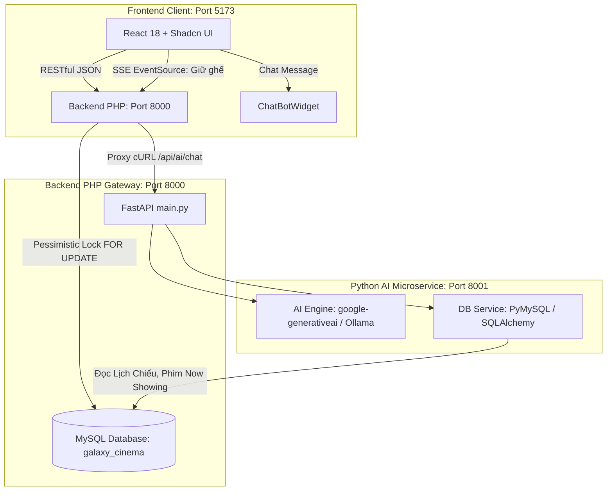

# 🎬 KẾ HOẠCH NÂNG CẤP HỆ THỐNG GALAXY CINEMA & TÍCH HỢP CHATBOX AI (PYTHON SERVICE)
> **Tài liệu phân công nhiệm vụ, ma trận tác động file, lộ trình kỹ thuật và tiêu chí nghiệm thu (Team 5 người)**  
> **Thời gian dự kiến:** 3 Tuần (15 ngày làm việc)  
> **Phiên bản:** 2.3 - Python AI Microservice Architecture  

---

## 📌 MỤC LỤC
1. [Tổng Quan Hiện Trạng & Mục Tiêu Nâng Cấp](#1-tổng-quan-hiện-trạng--mục-tiêu-nâng-cấp)
2. [Bảng Ma Trận Phân Chia Trách Nhiệm (5 Thành Viên)](#2-bảng-ma-trận-phân-chia-trách-nhiệm-5-thành-viên)
3. [Chi Tiết Nhiệm Vụ, Ma Trận Tác Động File & Hướng Giải Quyết Đề Xuất](#3-chi-tiết-nhiệm-vụ-ma-trận-tác-động-file--hướng-giải-quyết-đề-xuất)
   - [🔴 DEV 1: Team Leader – Backend Security & Concurrency](#dev-1-team-leader--backend-security--concurrency)
   - [🔵 DEV 2: Backend Business Logic & Thống Kê Admin](#dev-2-backend-business-logic--thống-kê-admin)
   - [🟣 DEV 3: Kỹ Sư AI Python Fullstack – Chatbox Assistant (Python Microservice)](#dev-3-kỹ-sư-ai-python-fullstack--chatbox-assistant-python-microservice)
   - [🟢 DEV 4: Frontend Core – Luồng Đặt Vé Thật & Realtime Sync](#dev-4-frontend-core--luồng-đặt-vé-thật--realtime-sync)
   - [🟡 DEV 5: Frontend Integration, Xóa Mock Data & Staff Scanner](#dev-5-frontend-integration-xóa-mock-data--staff-scanner)
4. [Lộ Trình Triển Khai 3 Tuần (Sprint Roadmap)](#4-lộ-trình-triển-khai-3-tuần-sprint-roadmap)
5. [Quy Chuẩn Git, Phân Nhánh & Chiến Lược Tránh Xung Đột](#5-quy-chuẩn-git-phân-nhánh--chiến-lược-tránh-xung-đột)

---

## 1. TỔNG QUAN HIỆN TRẠNG & MỤC TIÊU NÂNG CẤP

### 1.1. Các hạn chế nghiêm trọng cần khắc phục ngay
1. **Lỗ hổng bảo mật OTP:** Mã OTP lưu dạng JSON trên ổ đĩa (`backend/uploads/verification_codes.json`), dễ bị đọc trộm qua URL công khai.
2. **Đứt gãy luồng thanh toán:** Trang `PaymentPage.tsx` đang giả lập bằng `setTimeout` và sinh mã vé ngẫu nhiên, **chưa hề gọi API lưu đơn vào cơ sở dữ liệu MySQL**.
3. **Lỗi tranh chấp ghế (Race Condition):** Hàm kiểm tra ghế trống chưa có cơ chế khóa hàng `FOR UPDATE`, dẫn tới nguy cơ 2 người đặt trùng 1 ghế.
4. **Khuyết 7 Controller/Model ở Backend:** `backend/index.php` khai báo nhiều route (`promotions`, `loyalty`, `vouchers`, `admin/stats`,...) nhưng chưa hề có file xử lý logic trong `controllers/`.
5. **Dữ liệu giả (Mock Data) tràn lan:** `BookingHistoryPage`, `PromotionsPage`, `ProfilePage`, `AdminDashboard` đang đọc mảng tĩnh từ `mockData.ts`.

### 1.2. Các tính năng đột phá cần bổ sung
- 🤖 **Python AI Cinema Assistant:** Microservice độc lập viết bằng **Python (FastAPI + Free AI Libraries)** kết nối trực tiếp MySQL để lấy lịch chiếu, tư vấn phim thông minh theo cảm xúc, gợi ý phim kèm thẻ card có thể click đặt vé ngay.
- ⚡ **Real-time Seat Hold (SSE):** Ghế tự đổi màu vàng (Holding) trên màn hình người khác ngay khi có người giữ chỗ, không cần F5.
- 🎟️ **E-Ticket PDF & QR Scanner:** Xuất file PDF vé xem phim sang trọng và nâng cấp trang soát vé bằng Camera máy tính/điện thoại cho nhân viên.



---

## 2. BẢNG MA TRẬN PHÂN CHIA TRÁCH NHIỆM (5 THÀNH VIÊN)

| Thành viên | Vai trò chính | Module phụ trách | Độ ưu tiên |
| :--- | :--- | :--- | :---: |
| **DEV 1** | Team Leader & Backend Core | Bảo mật Auth, OTP MySQL, Khóa ghế Concurrency, Dọn rác Router, SSE Stream | 🔴 P0 (Khẩn cấp) |
| **DEV 2** | Backend Logic & Admin API | Bổ sung 7 Controller & Model (Promotion, Voucher, Loyalty, Membership, Admin, Config, Notification) | 🔴 P0 (Khẩn cấp) |
| **DEV 3** | AI Python Fullstack Engineer | Xây dựng Python AI Microservice (FastAPI + Free Python AI Libraries) + Widget Chatbot React | 🟡 P1 (Đột phá) |
| **DEV 4** | Frontend Core & Booking | Nối API Đặt vé thật vào DB, Nhận diện ghế Real-time, Xuất vé PDF E-Ticket | 🔴 P0 (Khẩn cấp) |
| **DEV 5** | Frontend Integration & UI | Xóa 100% Mock Data, Quét vé QR bằng Camera cho Staff, Chuẩn hóa tên file & Bản đồ | 🟡 P1 (Hoàn thiện) |

---

## 3. CHI TIẾT NHIỆM VỤ, MA TRẬN TÁC ĐỘNG FILE & HƯỚNG GIẢI QUYẾT ĐỀ XUẤT

---

### 🔴 DEV 1: Team Leader – Backend Security & Concurrency
* **Chuyên môn:** PHP, Database Architecture, Security.
* **Mục tiêu:** Vá triệt để lỗ hổng bảo mật, loại bỏ nợ kỹ thuật (technical debt), xử lý giao dịch dữ liệu toàn vẹn.

#### Danh mục công việc chi tiết:
1. **Khắc phục lỗ hổng OTP JSON:**
   - Xóa bỏ hoàn toàn việc ghi file `uploads/verification_codes.json`.
   - Tạo migration bảng `email_verifications` trong MySQL:
     ```sql
     CREATE TABLE email_verifications (
         id INT AUTO_INCREMENT PRIMARY KEY,
         email VARCHAR(255) NOT NULL,
         code VARCHAR(6) NOT NULL,
         expires_at DATETIME NOT NULL,
         created_at TIMESTAMP DEFAULT CURRENT_TIMESTAMP,
         INDEX idx_email_code (email, code)
     );
     ```
   - Cập nhật `backend/controllers/AuthController.php`: Phương thức `sendVerification` ghi mã OTP vào bảng trên (TTL = 5 phút); phương thức `verifyEmail` kiểm tra mã còn hạn và xóa mã ngay sau khi xác thực thành công.
2. **Xử lý Race Condition khi giữ ghế (Pessimistic Locking):**
   - Sửa hàm `getUnavailableSeats()` và `create()` trong `backend/models/Booking.php`.
   - Sử dụng `BEGIN TRANSACTION` và bổ sung **`FOR UPDATE`** vào câu truy vấn kiểm tra trạng thái vé:
     ```sql
     SELECT t.seat_id, t.status 
     FROM tickets t
     JOIN bookings b ON t.booking_id = b.id
     WHERE b.showtime_id = :showtime_id 
       AND t.seat_id IN (...)
       AND (t.status = 'SOLD' OR (t.status = 'HOLDING' AND t.hold_expires_at > NOW()))
     FOR UPDATE;
     ```
   - Nếu phát hiện ghế đã có người giữ, lập tức `ROLLBACK` và ném thông báo: *"Ghế vừa được người khác giữ chỗ, vui lòng chọn ghế khác!"*.
3. **Dọn dẹp mã nguồn & Tinh giản Router:**
   - **Xóa bỏ toàn bộ thư mục `backend/api/` cũ** (chấm dứt tình trạng chạy 2 router song song gây lỗi CORS).
   - Xóa bỏ dòng log đĩa `file_put_contents('debug_index_hit.txt')` trong `backend/index.php`.
   - Di chuyển/xóa bỏ 16 file script test ở root `backend/` (`login_direct.php`, `test_auth_apis.php`,...).
4. **Viết Endpoint Server-Sent Events (SSE) cho trạng thái ghế:**
   - Tạo endpoint `GET /api/showtimes/:id/seat-stream` trong `backend/controllers/ShowtimeController.php`.
   - Trả về Header `text/event-stream`, tự động gửi danh sách ID các ghế đang ở trạng thái `HOLDING` mỗi 3-5 giây.

#### 📊 Ma Trận Tác Động File & Hướng Giải Quyết (DEV 1):

| STT | Tác vụ | File cần sửa / tạo trực tiếp | File liên quan bị ảnh hưởng | Chi tiết ảnh hưởng & Hướng giải quyết đề xuất |
| :---: | :--- | :--- | :--- | :--- |
| 1 | **Chuyển OTP sang MySQL** | • Tạo mới: `backend/database/migrations/create_email_verifications_table.sql`<br>• Sửa: `backend/controllers/AuthController.php`<br>• Sửa: `backend/models/User.php` | • `backend/utils/EmailService.php`<br>• `source-code/galaxy-cinema-hub-main/src/pages/RegisterPage.tsx`<br>• `.gitignore` | **Ảnh hưởng:** `RegisterPage.tsx` đang mong đợi format response cũ; `EmailService` đang ghi log OTP.<br>**Giải quyết:** Giữ nguyên contract JSON `{ success: true, message: "..." }`. Xóa bỏ mọi thao tác đọc/ghi file `verification_codes.json`. Khi tạo OTP mới, tự động xóa các OTP cũ của email đó. Thêm index `(email, code)` trong MySQL để truy vấn tốc độ cao. |
| 2 | **Khóa ghế Concurrency `FOR UPDATE`** | • Sửa: `backend/models/Booking.php`<br>• Sửa: `backend/controllers/BookingController.php` | • `backend/models/Ticket.php`<br>• `source-code/galaxy-cinema-hub-main/src/pages/booking/SeatSelectionPage.tsx`<br>• `source-code/galaxy-cinema-hub-main/src/lib/api-client.ts` | **Ảnh hưởng:** Khi 2 client cùng chọn 1 ghế, client thứ 2 sẽ bị từ chối với HTTP 409 Conflict thay vì 200.<br>**Giải quyết:** Bao bọc logic tạo booking trong PDO Transaction. Nếu có ghế xung đột, rollback ngay và trả về HTTP 409 kèm message chi tiết. Ở frontend (`SeatSelectionPage.tsx`), bắt mã lỗi 409 để hiển thị Toast đỏ và tự động fetch lại sơ đồ ghế mới nhất. |
| 3 | **Xóa Router cũ `backend/api/` & File rác** | • Xóa thư mục: `backend/api/`<br>• Sửa: `backend/index.php`<br>• Xóa 16 file debug rác (`debug*.php`, `*direct.php`) | • `source-code/galaxy-cinema-hub-main/src/lib/api-config.ts`<br>• `Cinema-Booking-System-main/docker.yml`<br>• `.github/workflows/ci.yml` | **Ảnh hưởng:** Nếu frontend còn chỗ nào gọi URL dạng `/api/users/profile.php` thay vì `/api/users/:id/profile` sẽ bị 404.<br>**Giải quyết:** Rà soát `api-config.ts` để chắc chắn 100% endpoint trỏ qua Router trung tâm `index.php`. Kiểm tra CI workflow và docker run lệnh test không phụ thuộc vào các file rác bị xóa. |
| 4 | **Endpoint SSE Seat Stream** | • Sửa: `backend/controllers/ShowtimeController.php`<br>• Sửa: `backend/index.php` | • `backend/models/Ticket.php`<br>• `source-code/galaxy-cinema-hub-main/src/pages/booking/SeatSelectionPage.tsx` (DEV 4) | **Ảnh hưởng:** Kết nối SSE giữ connection lâu dài, nếu không tối ưu query sẽ gây nghẽn connection pool MySQL.<br>**Giải quyết:** Viết hàm tối ưu trong `Ticket.php` chỉ query đúng `SELECT seat_id FROM tickets WHERE booking_id IN (...) AND status = 'HOLDING' AND hold_expires_at > NOW()`. Set headers `text/event-stream`, `no-cache`, `flush()` sau mỗi vòng lặp 3 giây. Đóng connection an toàn khi client ngắt (`connection_aborted()`). |

* **Tiêu chí hoàn thành (DoD):**
  - [ ] Không còn file `verification_codes.json` trong `uploads/`.
  - [ ] Test đồng thời 2 request giữ cùng 1 ghế: Chỉ duy nhất 1 request thành công, request thứ hai nhận mã lỗi 409 Conflict.
  - [ ] Request toàn hệ thống đi qua `backend/index.php` trơn tru, không còn lỗi CORS `localhost:8080`.

---

### 🔵 DEV 2: Backend Business Logic & Thống Kê Admin
* **Chuyên môn:** PHP MVC, MySQL Query, API Design.
* **Mục tiêu:** Viết mới 7 Controller và Model đang khuyết để hoàn thành 100% đặc tả RESTful API.

#### Danh mục công việc chi tiết:
1. **Module Khuyến Mãi & Voucher:**
   - Tạo `backend/controllers/PromotionController.php` & `backend/models/Promotion.php`:
     - `GET /api/promotions`: Danh sách khuyến mãi đang hoạt động (`NOW() BETWEEN start_date AND end_date`).
     - `GET /api/promotions/:id`: Chi tiết điều kiện khuyến mãi.
     - `POST/PUT/DELETE /api/promotions` (Role: Admin/Manager).
   - Tạo `backend/controllers/VoucherController.php` & `backend/models/UserVoucher.php`:
     - `GET /api/vouchers/user/:userId`: Danh sách voucher cá nhân khả dụng.
     - `POST /api/vouchers/apply`: Kiểm tra điều kiện đơn hàng tối thiểu và tính số tiền giảm trừ.
2. **Module Điểm Thưởng (Loyalty) & Hạng Thành Viên (Membership):**
   - Tạo `backend/controllers/LoyaltyController.php` & `backend/models/LoyaltyHistory.php`:
     - `GET /api/loyalty/history/:userId`: Lịch sử cộng/trừ điểm.
     - `POST /api/loyalty/earn`: Tự động kích hoạt khi booking chuyển sang `Paid` (10.000đ = 1 điểm).
     - `POST /api/loyalty/redeem`: Đổi điểm lấy voucher khuyến mãi.
   - Tạo `backend/controllers/MembershipController.php` & `backend/models/Membership.php`:
     - `GET /api/memberships`: Lấy danh sách 4 hạng (Bronze, Silver, Gold, Platinum) kèm mức chiết khấu.
3. **Module Thông Báo (Notifications) & Cấu Hình (Configs):**
   - Tạo `backend/controllers/NotificationController.php` & `backend/models/Notification.php`:
     - `GET /api/notifications/user/:userId`: Lấy thông báo cá nhân (đặt vé thành công, voucher mới).
     - `PUT /api/notifications/:id/read`: Đánh dấu thông báo đã đọc.
   - Tạo `backend/controllers/ConfigController.php` & `backend/models/SystemConfig.php`:
     - `GET /api/config`: Trả về quy định tỷ lệ phim Việt tối thiểu (15%), thời gian giữ ghế (10 phút).
4. **Module Thống Kê Báo Cáo Admin:**
   - Tạo `backend/controllers/AdminController.php`:
     - `GET /api/admin/stats`: Doanh thu hôm nay/tháng, tổng số vé bán, số thành viên mới từ DB.
     - `GET /api/admin/revenue`: Báo cáo doanh thu theo mốc ngày cho biểu đồ Recharts.
     - `GET /api/admin/seat-heatmap`: Thống kê tần suất ghế được đặt nhiều nhất theo từng phòng chiếu.

#### 📊 Ma Trận Tác Động File & Hướng Giải Quyết (DEV 2):

| STT | Tác vụ | File cần sửa / tạo trực tiếp | File liên quan bị ảnh hưởng | Chi tiết ảnh hưởng & Hướng giải quyết đề xuất |
| :---: | :--- | :--- | :--- | :--- |
| 1 | **Tạo Controller & Model Promotions & Vouchers** | • Tạo: `backend/controllers/PromotionController.php`<br>• Tạo: `backend/models/Promotion.php`<br>• Tạo: `backend/controllers/VoucherController.php`<br>• Tạo: `backend/models/UserVoucher.php`<br>• Sửa: `backend/index.php` | • `source-code/galaxy-cinema-hub-main/src/pages/PromotionsPage.tsx` (DEV 5)<br>• `source-code/galaxy-cinema-hub-main/src/pages/booking/PaymentPage.tsx` (DEV 4)<br>• `source-code/galaxy-cinema-hub-main/src/components/profile/UserVouchersCard.tsx` | **Ảnh hưởng:** DEV 4 & DEV 5 cần contract JSON chính xác để render danh sách ưu đãi và áp mã giảm giá.<br>**Giải quyết:** Đăng ký các route chuẩn RESTful trong `index.php`. `VoucherController@apply` nhận payload `{ voucher_code, order_amount }`, kiểm tra `min_spend`, hạn dùng và trạng thái đã sử dụng, trả về số tiền giảm `discount_amount` và giá cuối `final_amount`. |
| 2 | **Tạo Controller & Model Loyalty & Membership** | • Tạo: `backend/controllers/LoyaltyController.php`<br>• Tạo: `backend/models/LoyaltyHistory.php`<br>• Tạo: `backend/controllers/MembershipController.php`<br>• Tạo: `backend/models/Membership.php`<br>• Sửa: `backend/controllers/TransactionController.php` | • `backend/models/User.php`<br>• `source-code/galaxy-cinema-hub-main/src/components/profile/LoyaltyHistoryCard.tsx`<br>• `source-code/galaxy-cinema-hub-main/src/contexts/AppContext.tsx` | **Ảnh hưởng:** Sau khi thanh toán vé, user cần được cộng điểm ngay vào `users.current_points` và thăng hạng nếu đủ điều kiện.<br>**Giải quyết:** Viết hook trong `TransactionController@confirm`: sau khi xác nhận thanh toán thành công, tự động gọi hàm `LoyaltyHistory::addPoints($userId, $points, $bookingId)`. Tính điểm theo cấu hình (mặc định 10.000đ = 1 điểm). Nếu tổng điểm vượt ngưỡng hạng mới, update `user_profiles.membership_id`. |
| 3 | **Tạo Controller Notification & Config** | • Tạo: `backend/controllers/NotificationController.php`<br>• Tạo: `backend/models/Notification.php`<br>• Tạo: `backend/controllers/ConfigController.php`<br>• Tạo: `backend/models/SystemConfig.php`<br>• Sửa: `backend/index.php` | • `source-code/galaxy-cinema-hub-main/src/components/NotificationDropdown.tsx`<br>• `source-code/galaxy-cinema-hub-main/src/pages/admin/AdminSettings.tsx` | **Ảnh hưởng:** Frontend cần load thông báo realtime/polling và hiển thị badge số lượng chưa đọc.<br>**Giải quyết:** Cung cấp endpoint `GET /api/notifications/user/:userId` trả về danh sách sắp xếp theo `created_at DESC`. Cung cấp endpoint `PUT /api/notifications/:id/read` và `PUT /api/notifications/user/:userId/read-all`. `ConfigController` trả về các hằng số quy định từ `Config.php`. |
| 4 | **Tạo Controller Admin Dashboard Analytics** | • Tạo: `backend/controllers/AdminController.php`<br>• Sửa: `backend/index.php` | • `source-code/galaxy-cinema-hub-main/src/pages/admin/AdminDashboard.tsx` (DEV 5)<br>• `source-code/galaxy-cinema-hub-main/src/pages/manager/ManagerDashboard.tsx`<br>• `source-code/galaxy-cinema-hub-main/src/components/admin/SeatHeatmap.tsx` | **Ảnh hưởng:** Biểu đồ Recharts yêu cầu định dạng mảng object `{ name: string, revenue: number, tickets: number }`.<br>**Giải quyết:** Viết câu truy vấn tổng hợp SQL `GROUP BY DATE(created_at)` lấy dữ liệu 7 ngày / 30 ngày gần nhất. Viết hàm `getSeatHeatmap` đếm số lần đặt ghế theo từng `hall_id` để vẽ bản đồ nhiệt. |

* **Tiêu chí hoàn thành (DoD):**
  - [ ] 7 file Controller và Model được tạo đúng chuẩn, tuân thủ `BaseController` và `Database::getInstance()`.
  - [ ] Toàn bộ 15 endpoint kiểm thử thành công bằng Postman, trả về mã HTTP 200/201 chuẩn RESTful.

---

### 🟣 DEV 3: Kỹ Sư AI Python Fullstack – Chatbox Assistant (Python Microservice)
* **Chuyên môn:** Python, FastAPI, Free AI/LLM Libraries, React UI/UX.
* **Mục tiêu:** Xây dựng dịch vụ **Python AI Microservice** độc lập, sử dụng hoàn toàn **thư viện mã nguồn mở và gói miễn phí (Free Tier)** của Python để phát triển trợ lý ảo Galaxy Cinema thông minh, tự động truy vấn lịch chiếu thật từ MySQL và tương tác đặt vé mượt mà.

#### Danh mục thư viện Python miễn phí đề xuất:
1. **Web Microservice:** `fastapi` + `uvicorn` (Mã nguồn mở, hiệu năng cực cao, hỗ trợ Async/Await, tự động sinh tài liệu API Swagger UI tại `http://localhost:8001/docs`).
2. **AI & LLM Engine (Lựa chọn 1 trong 2 giải pháp 100% miễn phí):**
   - **Giải pháp A (Cloud Free Tier - Khuyên dùng):** `google-generativeai` (Thư viện Python chính thức của Google, gói Free Tier cung cấp hạn mức miễn phí dồi dào, model `gemini-1.5-flash` trả lời cực nhanh < 1s).
   - **Giải pháp B (Local Open-Source 100% Offline):** `ollama` / `llama-cpp-python` (Chạy các mô hình mã nguồn mở gọn nhẹ như `Llama-3.2-3B`, `Qwen2.5-Coder`, `PhoGPT-4B` hoàn toàn miễn phí trên máy cục bộ, không phụ thuộc API key).
3. **Kết nối Dữ liệu MySQL (Database Integration):** `pymysql` hoặc `mysql-connector-python` (Đọc trực tiếp bảng `movies`, `cinemas`, `showtimes` trong database `galaxy_cinema` để làm ngữ cảnh).
4. **Data Validation & Tiện ích:** `pydantic` (Kiểm soát cấu trúc dữ liệu), `python-dotenv` (Đọc biến môi trường `.env`).

#### Danh mục công việc chi tiết:
1. **Khởi tạo Thư Mục & Cấu Trúc Dự Án Python Microservice:**
   - Tạo thư mục: `Cinema-Booking-System-main/ai-service/`:
     ```
     ai-service/
     ├── main.py                     # Entry point FastAPI, CORS Middleware, Router
     ├── requirements.txt            # Danh sách dependencies miễn phí
     ├── .env.example                # Cấu hình PORT=8001, DB_*, GEMINI_API_KEY
     ├── config.py                   # Đọc cấu hình môi trường bằng pydantic-settings
     ├── database.py                 # Kết nối MySQL database galaxy_cinema
     ├── services/
     │   ├── ai_service.py           # Gọi LLM (google-generativeai hoặc Ollama)
     │   └── cinema_service.py       # Query lấy phim đang chiếu & lịch chiếu làm context
     └── schemas.py                  # Pydantic schemas: ChatRequest, ChatResponse, MovieCard
     ```
   - Cấu hình file `requirements.txt`:
     ```text
     fastapi>=0.110.0
     uvicorn>=0.28.0
     google-generativeai>=0.4.0
     pymysql>=1.1.0
     python-dotenv>=1.0.1
     pydantic>=2.6.0
     ```
2. **Kỹ Thuật Bơm Ngữ Cảnh Tự Động (Dynamic Context RAG Nhẹ):**
   - Trong `cinema_service.py`: Sử dụng `pymysql` truy vấn các phim có `status = 'Now Showing'` (tên phim, thể loại, độ tuổi, thời lượng) và tên các rạp hiện có trong database `galaxy_cinema`.
   - Trong `ai_service.py`: Xây dựng **System Prompt** tiếng Việt đóng vai chuyên viên tư vấn rạp phim Galaxy Cinema:
     - Luôn lịch sự, vui vẻ, am hiểu các thể loại phim.
     - Chỉ gợi ý các bộ phim **đang thực sự chiếu** trong cơ sở dữ liệu.
     - Trả lời bằng Markdown kèm trích xuất danh sách ID các phim được gợi ý dạng JSON:
       ```json
       {
         "reply": "Chào bạn! Nếu bạn thích thể loại hành động kỳ ảo...",
         "recommended_movie_ids": [1, 4]
       }
       ```
3. **Tạo Endpoint FastAPI & Cơ Chế Kết Nối Hệ Thống:**
   - Trong `main.py`: Khởi tạo ứng dụng FastAPI chạy tại cổng `8001`:
     ```python
     # main.py
     from fastapi import FastAPI
     from fastapi.middleware.cors import CORSMiddleware
     from schemas import ChatRequest, ChatResponse
     from services.ai_service import generate_chat_response

     app = FastAPI(title="Galaxy Cinema AI Assistant Service")

     app.add_middleware(
         CORSMiddleware,
         allow_origins=["*"],
         allow_credentials=True,
         allow_methods=["*"],
         allow_headers=["*"],
     )

     @app.post("/api/chat", response_model=ChatResponse)
     async def chat_endpoint(request: ChatRequest):
         return await generate_chat_response(request.message, request.history)
     ```
   - **Tích hợp Gateway với Backend PHP (Tùy chọn an toàn):** Tạo `backend/controllers/AIController.php` để làm Proxy chuyển tiếp từ Backend PHP sang Python Service `http://localhost:8001/api/chat`. Hoặc Frontend gọi thẳng sang port 8001 qua CORS.
4. **Xây dựng Giao Diện Chatbox Widget ở Frontend (React):**
   - Tạo file `source-code/galaxy-cinema-hub-main/src/components/ai/ChatBotWidget.tsx`:
     - Nút tròn nổi ở góc dưới bên phải (`bottom-6 right-6 z-50`), biểu tượng Bot/Sparkles lấp lánh từ `lucide-react`.
     - Cửa sổ chat phong cách Glassmorphism / Dark Cinema: Có nút thu nhỏ, tiêu đề *"Galaxy AI Assistant"*, badge *"Python AI Online"*.
     - **Prompt Chips (Câu hỏi nhanh gợi ý):** *"🎬 Phim đang hot hôm nay"*, *"🍿 Combo bắp nước ưu đãi"*, *"🎟️ Hướng dẫn đặt vé"*, *"📍 Rạp gần tôi"*.
     - Hỗ trợ hiển thị Markdown cho tin nhắn của bot (in đậm, danh sách gạch đầu dòng).
5. **Thành phần Rich Movie Cards & Deep-link:**
   - Tạo component `src/components/ai/MovieCardMini.tsx`: Khi bot gợi ý phim, render một card nhỏ gồm ảnh Poster, tên phim, thời lượng, nhãn tuổi và nút bấm `[Đặt vé ngay]`.
   - Nhấp nút `[Đặt vé ngay]` sẽ tự động chuyển hướng người dùng tới `/movie/:id` hoặc `/booking/seats?movie=:id`.
   - Tạo `src/services/ai.service.ts` và nhúng `<ChatBotWidget />` vào `src/App.tsx`.

#### 📊 Ma Trận Tác Động File & Hướng Giải Quyết (DEV 3):

| STT | Tác vụ | File cần sửa / tạo trực tiếp | File liên quan bị ảnh hưởng | Chi tiết ảnh hưởng & Hướng giải quyết đề xuất |
| :---: | :--- | :--- | :--- | :--- |
| 1 | **Khởi tạo Python Microservice (FastAPI + Free Libs)** | • Tạo mới thư mục: `Cinema-Booking-System-main/ai-service/`<br>• Tạo: `ai-service/main.py`<br>• Tạo: `ai-service/requirements.txt`<br>• Tạo: `ai-service/.env` & `.env.example`<br>• Tạo: `ai-service/database.py` | • `.gitignore` (Root)<br>• `Cinema-Booking-System-main/docker.yml`<br>• `HUONG_DAN_CHAY_DU_AN.md` | **Ảnh hưởng:** Thư mục mới cần bỏ qua môi trường ảo Python (`venv/`, `__pycache__/`) trong Git, và tài liệu hướng dẫn cần bổ sung lệnh chạy service Python.<br>**Giải quyết:** Thêm `venv/`, `__pycache__/`, `*.pyc` vào `.gitignore`. Viết file `ai-service/README.md` và cập nhật `HUONG_DAN_CHAY_DU_AN.md`: Hướng dẫn tạo môi trường ảo `python -m venv venv`, `pip install -r requirements.txt` và khởi động bằng `uvicorn main:app --reload --port 8001`. |
| 2 | **Xây dựng AI Engine & Kết Nối MySQL (RAG Nhẹ)** | • Tạo: `ai-service/services/ai_service.py`<br>• Tạo: `ai-service/services/cinema_service.py`<br>• Tạo: `ai-service/schemas.py` | • Cơ sở dữ liệu MySQL `galaxy_cinema`<br>• Bảng `movies`, `cinemas`, `showtimes` | **Ảnh hưởng:** Nếu MySQL database bị tắt hoặc thông tin kết nối sai, AI service có thể bị treo khi khởi động.<br>**Giải quyết:** Trong `cinema_service.py`, sử dụng khối `try/except` khi kết nối MySQL: nếu database chưa sẵn sàng, nạp danh sách phim fallback mặc định từ file JSON nội bộ để bot vẫn trả lời được mà không bị sập. Dùng Pydantic schema để validate chặt chẽ dữ liệu đầu vào. |
| 3 | **Cấu hình Gateway PHP hoặc Direct CORS** | • Tạo/Sửa: `backend/controllers/AIController.php`<br>• Sửa: `backend/index.php`<br>• Sửa: `source-code/galaxy-cinema-hub-main/src/lib/api-config.ts` | • `source-code/galaxy-cinema-hub-main/src/services/ai.service.ts` | **Ảnh hưởng:** Gọi trực tiếp giữa các port khác nhau (Port 5173 $\rightarrow$ Port 8001) dễ phát sinh lỗi CORS preflight OPTIONS.<br>**Giải quyết:** Bật `CORSMiddleware` trong FastAPI cho phép `localhost:5173`. Đồng thời tại Backend PHP (Port 8000), cung cấp route proxy `/api/ai/chat` dùng `curl` chuyển tiếp sang `http://127.0.0.1:8001/api/chat` làm giải pháp dự phòng an toàn. |
| 4 | **Giao diện ChatBotWidget & Rich Movie Cards ở Frontend** | • Tạo: `src/components/ai/ChatBotWidget.tsx`<br>• Tạo: `src/components/ai/MovieCardMini.tsx`<br>• Tạo: `src/services/ai.service.ts` | • `source-code/galaxy-cinema-hub-main/src/App.tsx`<br>• `source-code/galaxy-cinema-hub-main/src/index.css`<br>• `src/pages/MovieDetailPage.tsx` | **Ảnh hưởng:** Cửa sổ chatbox có thể che khuất các nút thao tác chọn ghế hoặc thanh toán trên giao diện điện thoại.<br>**Giải quyết:** Cấu hình responsive cho `ChatBotWidget`: trên mobile chiếm tối đa 85vw x 70vh, có nút đóng/thu nhỏ rõ ràng. Khi khách bấm nút "Đặt vé ngay" trên card phim mini, gọi `useNavigate('/movie/' + id)` đồng thời tự động thu nhỏ chatbox để khách tiếp tục quy trình chọn rạp và ghế. |

* **Tiêu chí hoàn thành (DoD):**
  - [ ] Thư mục `ai-service/` khởi chạy mượt mà bằng lệnh `uvicorn main:app --port 8001`, tự động mở tài liệu Swagger UI tại `http://localhost:8001/docs`.
  - [ ] Thư viện Python sử dụng 100% miễn phí (FastAPI, PyMySQL, Google Generative AI free tier hoặc Ollama open-source), không phát sinh bất kỳ chi phí bản quyền nào.
  - [ ] Chatbox trả lời tiếng Việt trôi chảy, đọc đúng dữ liệu phim thực tế từ MySQL, hiển thị card phim có nút đặt vé hoạt động chuẩn xác.

---

### 🟢 DEV 4: Frontend Core – Luồng Đặt Vé Thật & Realtime Sync
* **Chuyên môn:** React TypeScript, State Management, PDF Generation.
* **Mục tiêu:** Xóa bỏ code giả lập đặt vé, kết nối thanh toán thật vào DB và phát triển tính năng xuất vé PDF.

#### Danh mục công việc chi tiết:
1. **Kết nối API Đặt Vé & Thanh Toán Thật:**
   - Cải tổ triệt để `PaymentPage.tsx`:
     - **Xóa bỏ hàm `handleSimulateSuccess` dùng `setTimeout` và sinh chuỗi vé ngẫu nhiên `GXY-2024-xxxx`**.
     - Khi người dùng bấm xác nhận thanh toán (Mô phỏng VietQR/MoMo thành công), gọi tuần tự chuỗi API thực tế:
       1. `POST /api/bookings`: Gửi `showtime_id`, danh sách `seat_ids`, `concessions`, `voucher_id` $\rightarrow$ Nhận về `booking_id`.
       2. `POST /api/transactions`: Gửi `booking_id`, `payment_method`, số tiền `final_price`.
       3. `PUT /api/bookings/:id/confirm`: Xác nhận thanh toán thành công $\rightarrow$ Backend cập nhật trạng thái vé sang `SOLD` và sinh `ticket_code` thật.
     - Sau khi nhận phản hồi thành công từ server mới điều hướng sang `BookingSuccessPage` với dữ liệu thật.
2. **Đồng Bộ Trạng Thái Ghế Real-time (Client):**
   - Cập nhật `SeatSelectionPage.tsx`:
     - Khởi tạo kết nối `EventSource` tới endpoint `/api/showtimes/:id/seat-stream` của DEV 1 (kèm cơ chế Fallback Polling 5s).
     - Khi nhận sự kiện có ghế vừa chuyển sang trạng thái `HOLDING` bởi khách khác, ngay lập tức cập nhật state đổi ghế đó sang màu vàng và disable không cho click.
3. **Tính Năng Xuất Vé Điện Tử E-Ticket (PDF & QR):**
   - Cài đặt thư viện: `npm install jspdf html2canvas qrcode.react`.
   - Thiết kế component `TicketPDF.tsx`:
     - Khổ vé chuẩn (giống vé xem phim CGV/Galaxy thực tế).
     - Thông tin hiển thị: Tên phim, Poster, Rạp, Phòng chiếu, Suất chiếu, Vị trí ghế, Tên khách hàng, Mã đơn hàng.
     - Mã QR Code sắc nét chứa chuỗi token `ticket_code` để quét tại cửa rạp.
   - Thêm nút "Tải vé điện tử PDF" tại `BookingSuccessPage` và trong từng item của `BookingHistoryPage`.

#### 📊 Ma Trận Tác Động File & Hướng Giải Quyết (DEV 4):

| STT | Tác vụ | File cần sửa / tạo trực tiếp | File liên quan bị ảnh hưởng | Chi tiết ảnh hưởng & Hướng giải quyết đề xuất |
| :---: | :--- | :--- | :--- | :--- |
| 1 | **Nối API Booking Thật & Xóa `setTimeout`** | • Sửa triệt để: `src/pages/booking/PaymentPage.tsx`<br>• Sửa: `src/pages/booking/BookingSuccessPage.tsx`<br>• Tạo/Sửa: `src/services/booking.service.ts` | • `src/pages/booking/SeatSelectionPage.tsx`<br>• `src/contexts/AppContext.tsx`<br>• `backend/controllers/BookingController.php`<br>• `backend/controllers/TransactionController.php` | **Ảnh hưởng:** Nếu F5 tại trang `PaymentPage`, mất dữ liệu `bookingData` dẫn đến không gọi được API tạo đơn.<br>**Giải quyết:** Lưu tạm state đặt vé vào `sessionStorage` (`selectedShowtime`, `selectedSeats`, `concessions`). Tại `PaymentPage.tsx`, khi click thanh toán, gọi liên hoàn 3 API của Backend: Tạo booking -> Tạo transaction -> Xác nhận thanh toán. Chỉ khi backend trả về HTTP 200 mới chuyển sang `BookingSuccessPage` và xóa `sessionStorage`. |
| 2 | **Lắng Nghe Sự Kiện Ghế Realtime (SSE Client)** | • Sửa: `src/pages/booking/SeatSelectionPage.tsx` | • `backend/controllers/ShowtimeController.php` (DEV 1)<br>• `src/components/booking/CountdownTimer.tsx` | **Ảnh hưởng:** Nếu backend chưa hoàn thành endpoint SSE hoặc mạng chập chờn, giao diện chọn ghế sẽ bị treo.<br>**Giải quyết:** Khởi tạo `EventSource` bên trong `useEffect`. Bắt sự kiện `onerror`: nếu kết nối SSE thất bại quá 2 lần, tự động chuyển sang cơ chế Polling `setInterval(fetchOccupiedSeats, 5000)`. Khi unmount component, bắt buộc gọi `eventSource.close()` để tránh rò rỉ bộ nhớ. |
| 3 | **Xuất Vé PDF E-Ticket & Sinh Mã QR** | • Tạo: `src/components/booking/TicketPDF.tsx`<br>• Sửa: `src/pages/booking/BookingSuccessPage.tsx`<br>• Sửa: `src/pages/BookingHistoryPage.tsx` | • `package.json`<br>• `src/services/ticket.service.ts`<br>• `src/pages/staff/StaffScanner.tsx` (DEV 5) | **Ảnh hưởng:** `html2canvas` có thể không render được ảnh poster nếu bị lỗi CORS hình ảnh từ server ngoài.<br>**Giải quyết:** Đặt cờ `useCORS: true` cho `html2canvas`. Component `TicketPDF` được render ẩn ngoài màn hình (off-screen) với thiết kế gradient đen - vàng sang trọng. Mã QR dùng `qrcode.react` mã hóa chuỗi `ticket_code` thật từ DB để máy quét của DEV 5 nhận diện chính xác 100%. |

* **Tiêu chí hoàn thành (DoD):**
  - [ ] Thực hiện một lượt đặt vé từ đầu đến cuối: Sau khi hoàn tất, mở phpMyAdmin kiểm tra thấy bản ghi mới xuất hiện trong cả 3 bảng `bookings`, `tickets`, `transactions`.
  - [ ] Ghế đã được người khác giữ không thể bị click chọn đè.
  - [ ] Bấm "Tải vé PDF" tải về file `.pdf` rõ nét, quét mã QR trên vé ra đúng chuỗi `ticket_code`.

---

### 🟡 DEV 5: Frontend Integration, Xóa Mock Data & Staff Scanner
* **Chuyên môn:** React Integration, Camera API, UI Refactoring.
* **Mục tiêu:** Xóa bỏ 100% Mock Data còn tồn đọng ở các trang Client & Admin, hoàn thiện máy quét vé Camera cho nhân viên.

#### Danh mục công việc chi tiết:
1. **Xóa Mock Data ở các trang Khách Hàng (Client Pages):**
   - `BookingHistoryPage.tsx`: Xóa mảng cứng `bookings = [...]`, gọi API `GET /api/bookings/user/:userId` và `GET /api/tickets/booking/:id` để hiển thị lịch sử đặt vé thật.
   - `PromotionsPage.tsx`: Xóa mảng cứng `promotions = [...]`, gọi API `GET /api/promotions` do DEV 2 cung cấp.
   - `ProfilePage.tsx`: Bỏ import `mockData.ts`, kết nối API `GET /api/loyalty/history/:userId` và `GET /api/vouchers/user/:userId`.
2. **Xóa Mock Data ở trang Quản Trị (Admin & Manager Dashboard):**
   - Cập nhật `AdminDashboard.tsx` và `ManagerDashboard.tsx`:
     - Gọi `GET /api/admin/stats`: Hiển thị doanh thu thật, số vé đã bán thật.
     - Gọi `GET /api/admin/revenue`: Render biểu đồ doanh thu theo tuần/tháng bằng Recharts.
     - Nối dữ liệu thật cho component `SeatHeatmap.tsx`.
3. **Nâng Cấp Quét Vé Bằng Camera (Staff Scanner):**
   - Cài đặt thư viện: `npm install html5-qrcode`.
   - Nâng cấp trang `StaffScanner.tsx`:
     - Cho phép nhân viên bật Camera thiết bị (Webcam hoặc Camera sau điện thoại) để quét mã QR vé của khách.
     - Khi nhận diện được mã QR, tự động gọi API `POST /api/tickets/check` kèm âm thanh "Bíp" xác nhận vé hợp lệ hoặc cảnh báo đỏ nếu vé giả/vé đã qua sử dụng.
4. **Chuẩn Hóa Tên File & Thay Thế Bản Đồ:**
   - **Đổi tên file bị ngược:** Đổi `CinemasPage.tsx` thành `MoviesListPage.tsx`; đổi `CinemasListPage.tsx` thành `CinemasPage.tsx`, cập nhật lại router trong `src/App.tsx`.
   - **Tối ưu bản đồ:** Thay thế `maplibre-gl` phức tạp phụ thuộc 2 key ngoài trong `CinemaMap.tsx` bằng Google Maps Embed iframe (hoặc Leaflet OpenStreetMap) nhẹ nhàng, không lo bị hết quota API.

#### 📊 Ma Trận Tác Động File & Hướng Giải Quyết (DEV 5):

| STT | Tác vụ | File cần sửa / tạo trực tiếp | File liên quan bị ảnh hưởng | Chi tiết ảnh hưởng & Hướng giải quyết đề xuất |
| :---: | :--- | :--- | :--- | :--- |
| 1 | **Xóa Mock Data các trang Client** | • Sửa: `src/pages/BookingHistoryPage.tsx`<br>• Sửa: `src/pages/PromotionsPage.tsx`<br>• Sửa: `src/pages/ProfilePage.tsx`<br>• Sửa: `src/components/profile/UserVouchersCard.tsx`<br>• Sửa: `src/components/profile/LoyaltyHistoryCard.tsx` | • `src/data/mockData.ts`<br>• `src/services/promotion.service.ts`<br>• `src/services/ticket.service.ts`<br>• `src/contexts/AppContext.tsx` | **Ảnh hưởng:** Khi user chưa từng đặt vé hoặc chưa có voucher, các trang có thể bị lỗi `undefined.map()` hoặc màn hình trắng xoá.<br>**Giải quyết:** Bọc dữ liệu bằng optional chaining `data?.map(...)`. Thêm Skeleton Loading khi `isLoading = true` và component `EmptyState` thân thiện ("Bạn chưa có đơn đặt vé nào, hãy khám phá phim hot ngay!") khi mảng rỗng. Xóa triệt để các biến import từ `mockData.ts`. |
| 2 | **Xóa Mock Data trang Admin & Manager** | • Sửa: `src/pages/admin/AdminDashboard.tsx`<br>• Sửa: `src/pages/manager/ManagerDashboard.tsx`<br>• Sửa: `src/components/admin/SeatHeatmap.tsx`<br>• Tạo: `src/services/admin.service.ts` | • `src/data/mockData.ts`<br>• `backend/controllers/AdminController.php` (DEV 2) | **Ảnh hưởng:** Nếu cơ sở dữ liệu mới khởi tạo chưa có nhiều giao dịch, biểu đồ Recharts có thể bị lỗi trục tọa độ X/Y.<br>**Giải quyết:** Viết hàm định dạng dữ liệu (Data Transformer) tại `admin.service.ts`: nếu ngày nào không có doanh thu, tự động điền `0` để biểu đồ Recharts luôn liên tục, không bị đứt đoạn. |
| 3 | **Tích Hợp Camera Quét Mã QR Cho Staff** | • Sửa: `src/pages/staff/StaffScanner.tsx`<br>• Sửa: `src/components/staff/TicketChecker.tsx` | • `package.json`<br>• `backend/controllers/TicketController.php`<br>• Thư mục `public/sounds/` | **Ảnh hưởng:** Trình duyệt yêu cầu quyền truy cập Camera (HTTPS hoặc localhost). Cần xử lý trường hợp thiết bị không có camera hoặc người dùng chặn quyền.<br>**Giải quyết:** Sử dụng thư viện `html5-qrcode`. Thêm khối `try/catch` kiểm tra quyền camera: nếu bị chặn, hiển thị input nhập mã vé bằng tay (fallback). Khi quét thành công, gọi `POST /api/tickets/check`, phát âm thanh `new Audio('/sounds/beep.mp3').play()` và hiển thị Dialog thông tin vé. |
| 4 | **Đổi Tên File Chuẩn Hóa & Thay Bản Đồ** | • Đổi tên: `CinemasPage.tsx` $\rightarrow$ `MoviesListPage.tsx`<br>• Đổi tên: `CinemasListPage.tsx` $\rightarrow$ `CinemasPage.tsx`<br>• Sửa: `src/components/cinema/CinemaMap.tsx` | • `src/App.tsx`<br>• `src/components/layout/Header.tsx`<br>• `src/components/layout/Footer.tsx`<br>• `.env` (Frontend) | **Ảnh hưởng:** Đổi tên file dễ dẫn đến hỏng import ở nhiều file khác nhau khiến Vite build bị lỗi compile.<br>**Giải quyết:** Tiến hành đổi tên file bằng lệnh Git (`git mv`). Cập nhật ngay các câu lệnh `import` trong `src/App.tsx`, `Header.tsx`, `Footer.tsx`. Trong `CinemaMap.tsx`, thay thế MapLibre bằng `iframe` Google Maps Embed hoặc Leaflet OpenStreetMap nhẹ hơn, loại bỏ sự phụ thuộc vào 2 API key Maptiler và ORS. |

* **Tiêu chí hoàn thành (DoD):**
  - [ ] Không còn bất kỳ file nào trong `src/pages/` import biến từ `src/data/mockData.ts`.
  - [ ] Nhân viên mở trang `/staff/scanner`, đưa mã QR trên vé PDF vào Camera: Hệ thống đọc được mã và báo "Hợp lệ - Cho vào rạp".

---

## 4. LỘ TRÌNH TRIỂN KHAI 3 TUẦN (SPRINT ROADMAP)

```mermaid
gantt
    title Lộ Trình Triển Khai Refactor & Nâng Cấp Hệ Thống (3 Tuần)
    dateFormat  YYYY-MM-DD
    section Tuần 1: Cốt Lõi & An Toàn
    DEV 1: Vá lỗi OTP DB & Khóa FOR UPDATE          :active, t1_1, 2026-09-15, 3d
    DEV 1: Dọn dẹp router cũ & xóa file test rác    :t1_2, after t1_1, 2d
    DEV 2: Bổ sung 7 Controller & Model mới         :active, t1_3, 2026-09-15, 5d
    DEV 3: Khởi tạo Python FastAPI & PyMySQL        :active, t1_4, 2026-09-15, 5d
    section Tuần 2: Nối API & Trải Nghiệm Mới
    DEV 4: Nối API Booking thật (bỏ setTimeout)    :t2_1, 2026-09-22, 4d
    DEV 4: Tích hợp đồng bộ ghế Realtime SSE        :t2_2, after t2_1, 2d
    DEV 5: Xóa Mock Data các trang Client/Admin     :t2_3, 2026-09-22, 4d
    DEV 5: Chuẩn hóa tên file & tối ưu bản đồ       :t2_4, after t2_3, 2d
    DEV 3: Tích hợp LLM Free & ChatBotWidget React :t2_5, 2026-09-22, 5d
    section Tuần 3: Hoàn Thiện & Nghiệm Thu
    DEV 4: Xuất vé E-Ticket PDF có mã QR           :t3_1, 2026-09-29, 3d
    DEV 5: Quét mã QR bằng Camera cho Staff POS     :t3_2, 2026-09-29, 3d
    DEV 3: Tinh chỉnh Prompt tiếng Việt & Test AI   :t3_3, 2026-09-29, 2d
    CẢ NHÓM: Kiểm thử E2E toàn hệ thống & Tối ưu    :milestone, 2026-10-02, 2d
```

---

## 5. QUY CHUẨN GIT, PHÂN NHÁNH & CHIẾN LƯỢC TRÁNH XUNG ĐỘT

Để 5 thành viên làm việc song song hiệu quả mà không bị lỗi đè mã nguồn (Merge Conflicts) TUYỆT ĐỐI **không commit trực tiếp lên nhánh `main`**. Mỗi thành viên tạo nhánh riêng


---
*Tài liệu này được lưu trữ tại `docs/KE_HOACH_NANG_CAP_5_NGUOI.md` để toàn bộ nhóm cùng theo dõi tiến độ.*
