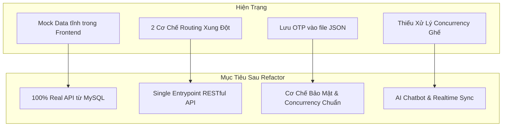
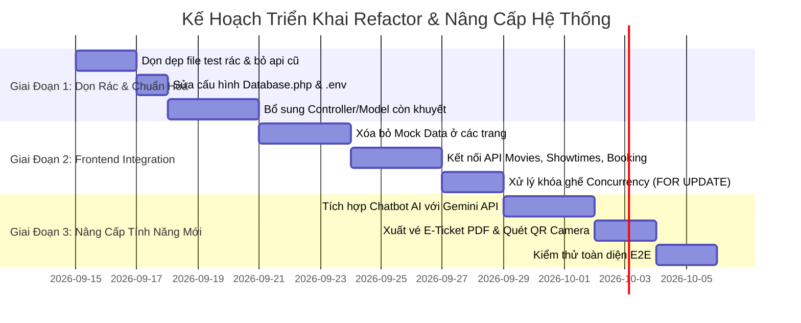

# 🎬 ĐỀ XUẤT CHIẾN LƯỢC REFACTOR & NÂNG CẤP HỆ THỐNG GALAXY CINEMA

> **Tài liệu phân tích kỹ thuật và định hướng nâng cấp hệ thống đặt vé xem phim trực tuyến**  
> **Phiên bản:** 2.0  
> **Mục tiêu:** Tối ưu hóa hiệu năng, loại bỏ mã dư thừa/lỗi thời, hoàn thiện các luồng nghiệp vụ còn dang dở và bổ sung các tính năng hiện đại (AI Cinema Assistant, Real-time Seat Locking, E-Ticket PDF).

---

## 1. TỔNG QUAN HIỆN TRẠNG & ĐỊNH HƯỚNG

Dự án hiện tại có nền tảng cơ sở dữ liệu (`schema.sql`) và giao diện Frontend (`React + Tailwind + Shadcn`) rất tốt và bắt mắt. Tuy nhiên, trong quá trình phát triển theo nhóm, mã nguồn gặp phải một số điểm phân mảnh:
- Tồn tại **2 mô hình kiến trúc song song** (kiểu cũ theo file lẻ trong `backend/api/` và kiểu mới theo Router tập trung `backend/index.php`).
- Nhiều thành phần frontend vẫn đang dùng **Mock Data tĩnh**, chưa đồng bộ với cơ sở dữ liệu.
- Một số thành phần cồng kềnh không cần thiết hoặc gây rủi ro bảo mật (như lưu OTP vào file JSON trên ổ đĩa).



---

## 2. CÁC CHỨC NĂNG & THÀNH PHẦN NÊN LOẠI BỎ HOẶC TINH GIẢN (WHAT TO DROP / SIMPLIFY)

| STT | Thành phần / Chức năng | Hiện trạng & Vấn đề | Đề xuất giải pháp (Lược bỏ / Thay thế) |
| :---: | :--- | :--- | :--- |
| **1** | **Thư mục `backend/api/` cũ** | Chứa các file lẻ như `api/movies/index.php`, `api/movies/detail.php` với CORS hardcode `localhost:8080`. Trùng lặp với `core/Router.php`. | **Xóa bỏ hoàn toàn**. Toàn bộ request sẽ đi qua `backend/index.php` với chuẩn RESTful: `/api/movies`, `/api/movies/:id`. |
| **2** | **Lưu OTP vào file `verification_codes.json`** | File JSON lưu mã 6 số dễ bị race condition khi ghi đồng thời, nguy cơ lộ mã nếu thư mục uploads public, khó scale. | **Thay thế bằng bảng `email_verifications`** trong database (hoặc session/cache tạm thời) có index `expires_at` để tự hủy. |
| **3** | **17+ file test và debug rác ở root backend** | Các file `login_direct.php`, `debug_router.php`, `test_api.php`, `debug_index_hit.txt`, `debug_route_log.json` gây chậm I/O đĩa và rác mã nguồn. | **Xóa bỏ mã debug ghi đè đĩa**, gom các script kiểm thử API vào thư mục chuẩn `scripts/tests/`. |
| **4** | **Bản đồ phức tạp MapLibre + 2 API Keys ngoài** | Dùng MapLibre GL cùng lúc 2 bên thứ 3 (MapTiler + OpenRouteService) tốn quota API, code cồng kềnh và dễ lỗi CORS/Key limit. | **Tinh giản thành Google Maps Embed (iframe)** hoặc Leaflet OpenStreetMap miễn phí, nhẹ nhàng, hiển thị vị trí rạp tức thì không cần key. |
| **5** | **Webhook phức tạp cho VNPay / MoMo** | MoMo/VNPay thật đòi hỏi IP tĩnh / domain HTTPS public có đăng ký merchant doanh nghiệp để nhận IPN Callback. | **Chuẩn hóa thành "Simulated Payment Gateway" (Cổng giả lập thông minh)**: Sinh mã QR VietQR / MoMo động kèm bộ đếm thời gian thực, có nút "Mô phỏng thanh toán thành công/thất bại" để test trọn vẹn luồng. |
| **6** | **Mock data tĩnh trong các trang Client & Admin** | Các file `mockData.ts`, mảng tĩnh trong `PromotionsPage.tsx`, `BookingHistoryPage.tsx` khiến hệ thống không phản ánh đúng DB. | **Loại bỏ toàn bộ mock data**, chuyển 100% sang gọi API từ Backend. |

---

## 3. CÁC TÍNH NĂNG MỚI ĐỀ XUẤT BỔ SUNG (WHAT TO ADD)

### 3.1. 🤖 AI Cinema Assistant (Chatbot Tư Vấn Phim & Đặt Vé Thông Minh)
- **Mô tả**: Trợ lý ảo AI tích hợp góc dưới màn hình, đóng vai nhân viên chăm sóc khách hàng của Galaxy Cinema.
- **Khả năng nổi bật**:
  - Gợi ý phim theo cảm xúc / nhu cầu: *"Tôi muốn xem phim hành động gay cấn có suất chiếu sau 20h tại quận 1"*, *"Có phim hoạt hình nào phù hợp cho bé 8 tuổi không?"*.
  - Tra cứu suất chiếu và rạp còn ghế trống theo ngôn ngữ tự nhiên.
  - Giải thích quy định độ tuổi (P, T13, T16, T18) và cảnh báo quy định giờ giới nghiêm trẻ em sau 22h/23h.
  - Hướng dẫn áp mã giảm giá, tính điểm thành viên.
- **Kỹ thuật triển khai**:
  - Tích hợp **Google Gemini API** (`gemini-1.5-flash` hoặc `gemini-2.5-flash`) cực nhanh và miễn phí hạn mức cao.
  - Tạo endpoint an toàn phía backend: `POST /api/ai/chat` (không để lộ API key ở Frontend).
  - Sử dụng cơ chế **Function Calling / Context Injection**: Backend đọc danh sách các phim "Đang chiếu" từ Database nhúng vào System Prompt để AI luôn trả lời đúng lịch chiếu thực tế của rạp.

### 3.2. ⚡ Real-Time Seat Hold Sync (Đồng Bộ Trạng Thái Ghế Tức Thì)
- **Mô tả**: Khi Khách hàng A bấm chọn 1 ghế và vào bước giữ chỗ (HOLDING 10 phút), ngay lập tức trên màn hình của Khách hàng B (đang cùng xem sơ đồ phòng chiếu đó) ghế đó sẽ đổi màu vàng (Đang giữ chỗ) mà không cần F5 tải lại trang.
- **Kỹ thuật triển khai**:
  - Dùng **Server-Sent Events (SSE)** tại endpoint `GET /api/showtimes/:id/seat-stream`.
  - SSE cực kỳ nhẹ, hỗ trợ native trên mọi trình duyệt (`EventSource`), không đòi hỏi setup WebSocket phức tạp trên máy chủ PHP/Apache.
  - Phía DB: Tự động phát sinh event khi có ticket mới ở trạng thái `HOLDING` hoặc khi hết hạn 10 phút chuyển sang `REFUNDED`.

### 3.3. 🎟️ Xuất Vé Điện Tử E-Ticket (PDF & Mã QR Check-in)
- **Mô tả**: Sau khi thanh toán thành công, thay vì chỉ xem trên web, khách hàng có thể:
  - Tải về file PDF vé xem phim thiết kế chuẩn Galaxy Cinema (có Poster phim, số ghế, rạp, phòng chiếu, mã QR sắc nét).
  - Nhận vé tự động qua Email (tận dụng EmailService SMTP Gmail đã có).
- **Kỹ thuật triển khai**:
  - Frontend: Sử dụng thư viện `jspdf` và `html2canvas` để xuất vé tức thì tại client.
  - QR Code: Dùng thư viện `qrcode.react` để tạo mã QR chứa chuỗi token xác thực chống làm giả.

### 3.4. 🍿 Smart Combo & Upselling (Gợi Ý Bắp Nước Thông Minh)
- **Mô tả**: Tại bước chọn bắp nước, hệ thống tự động gợi ý gói tối ưu dựa trên số lượng vé đã chọn:
  - Chọn 2 vé ghế đôi (Sweetbox) -> Tự động highlight **Combo Couple** (1 bắp lớn + 2 nước ngọt) kèm mức giảm 15%.
  - Chọn vé vào ngày sinh nhật của user -> Gợi ý nhận bắp nước miễn phí theo chính sách Loyalty.
- **Kỹ thuật triển khai**:
  - Viết logic Rule-based Recommendation trong `concession.service.ts` kết hợp với thông tin giỏ hàng từ `BookingContext`.

### 3.5. 📱 Quét Vé Bằng Camera Thiết Bị Cho Nhân Viên (Staff Scanner POS)
- **Mô tả**: Trang `/staff/scanner` hiện tại chỉ nhập text mã vé thủ công. Nâng cấp để nhân viên có thể bật Camera điện thoại / Webcam laptop để quét trực tiếp mã QR trên điện thoại khách hàng.
- **Kỹ thuật triển khai**:
  - Tích hợp thư viện `html5-qrcode` (nhẹ, hỗ trợ đa nền tảng iOS/Android/Desktop).
  - Tự động gọi API `POST /api/tickets/check` ngay khi camera đọc được mã, phát âm thanh "Bíp" thành công / cảnh báo nếu vé giả hoặc đã dùng.

---

## 4. ĐỀ XUẤT KỸ THUẬT & KIẾN TRÚC MÃ NGUỒN (HOW TO IMPLEMENT)

### 4.1. Kiến Trúc Backend (PHP 8.x MVC Clean Architecture)
Chuẩn hóa cấu trúc thư mục backend để chuyên nghiệp và dễ bảo trì:

```
backend/
├── config/             # Cấu hình DB, JWT, App Config (Đọc từ .env)
├── core/               # Router, Request, Response chuẩn hóa
├── controllers/        # Tiếp nhận request, gọi Service, trả Response
├── service/            # Chứa 100% nghiệp vụ (Business Logic):
│   ├── AuthService.php
│   ├── BookingService.php
│   ├── ShowtimeService.php
│   ├── AIService.php       # [MỚI] Gọi Gemini API
│   └── PaymentService.php
├── models/             # Thao tác cơ sở dữ liệu PDO (Prepared statements)
├── middleware/         # AuthMiddleware (JWT), RoleMiddleware, CorsMiddleware
└── index.php           # Single Entrypoint
```

#### Xử lý triệt để Race Condition khi giữ ghế (Pessimistic Locking):
Trong `backend/models/Booking.php`, sử dụng `FOR UPDATE` trong Transaction khi kiểm tra ghế trống:
```php
// Bắt đầu Transaction
$this->db->beginTransaction();

// Khóa các bản ghi vé liên quan đến các ghế này trong suất chiếu để tránh đọc đồng thời
$stmt = $this->db->prepare(
    "SELECT t.seat_id, t.status, t.hold_expires_at 
     FROM tickets t 
     JOIN bookings b ON t.booking_id = b.id 
     WHERE b.showtime_id = :showtime_id 
       AND t.seat_id IN ($placeholders) 
       AND (t.status = 'SOLD' OR (t.status = 'HOLDING' AND t.hold_expires_at > NOW()))
     FOR UPDATE"
);
$stmt->execute($params);
$conflictSeats = $stmt->fetchAll(PDO::FETCH_COLUMN);

if (!empty($conflictSeats)) {
    $this->db->rollBack();
    throw new Exception("Một số ghế vừa có người khác giữ chỗ!");
}

// Tiến hành tạo booking và tickets với status HOLDING...
$this->db->commit();
```

---

### 4.2. Kiến Trúc Frontend (React 18 + TypeScript + TanStack Query)
Hợp nhất toàn bộ việc gọi API về một cấu trúc thống nhất:

```
src/
├── services/           # Lớp Service gọi API (Type-safe)
│   ├── auth.service.ts
│   ├── movie.service.ts
│   ├── showtime.service.ts
│   ├── booking.service.ts
│   ├── concession.service.ts
│   └── ai.service.ts       # [MỚI] Gửi nhận chat với AI Assistant
├── lib/
│   ├── api-client.ts   # Axios/Fetch wrapper tự đính kèm JWT Bearer Token
│   └── api-config.ts   # Quản lý tập trung các Endpoint URLs
├── components/
│   ├── ai/             # [MỚI] ChatBotWidget.tsx (Cửa sổ chat nổi góc màn hình)
│   ├── booking/        # SeatMap, QuickBookingBar, ConcessionSelector
│   └── staff/          # Scanner Camera, POS
└── contexts/
    ├── AppContext.tsx  # Quản lý User Auth & Giỏ vé Booking State
    └── ThemeContext.tsx
```

---

## 5. LỘ TRÌNH TRIỂN KHAI THEO GIAI ĐOẠN (ROADMAP)



### Chi tiết các bước:
1. **Giai đoạn 1: Dọn rác & Chuẩn hóa Backend (Tuần 1)**
   - Xóa các file test phân tán ở `backend/` và thư mục `backend/api/`.
   - Bổ sung 7 Controller & Model còn thiếu (`Promotion`, `Voucher`, `Loyalty`, `Membership`, `Admin`, `Config`, `Notification`).
   - Chuẩn hóa router và error handling.
2. **Giai đoạn 2: Thay thế Mock Data & Khóa Concurrency (Tuần 2)**
   - Thay thế toàn bộ mock data trong `PromotionsPage`, `BookingHistoryPage`, `ProfilePage`, `AdminDashboard`.
   - Áp dụng `FOR UPDATE` trong giao dịch giữ ghế của `Booking.php`.
   - Kiểm tra luồng đặt vé khép kín: Chọn phim -> Chọn ghế -> Giữ chỗ 10p -> Thanh toán -> Sinh vé.
3. **Giai đoạn 3: Bổ sung AI Assistant & Trải Nghiệm Mới (Tuần 3)**
   - Viết API `POST /api/ai/chat` kết nối Gemini API, nhúng dữ liệu phim thực tế.
   - Xây dựng component `ChatBotWidget.tsx` đẹp mắt, mượt mà ở góc phải màn hình.
   - Thêm tính năng xuất vé PDF có mã QR và nâng cấp trang quét vé bằng Camera.
